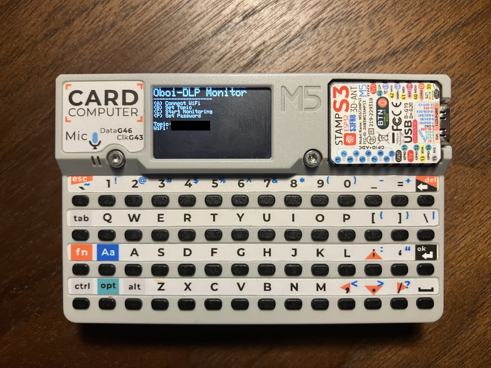
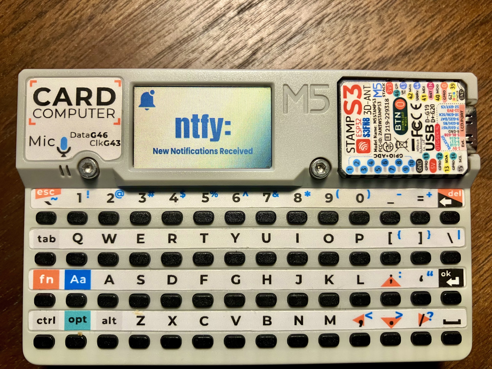
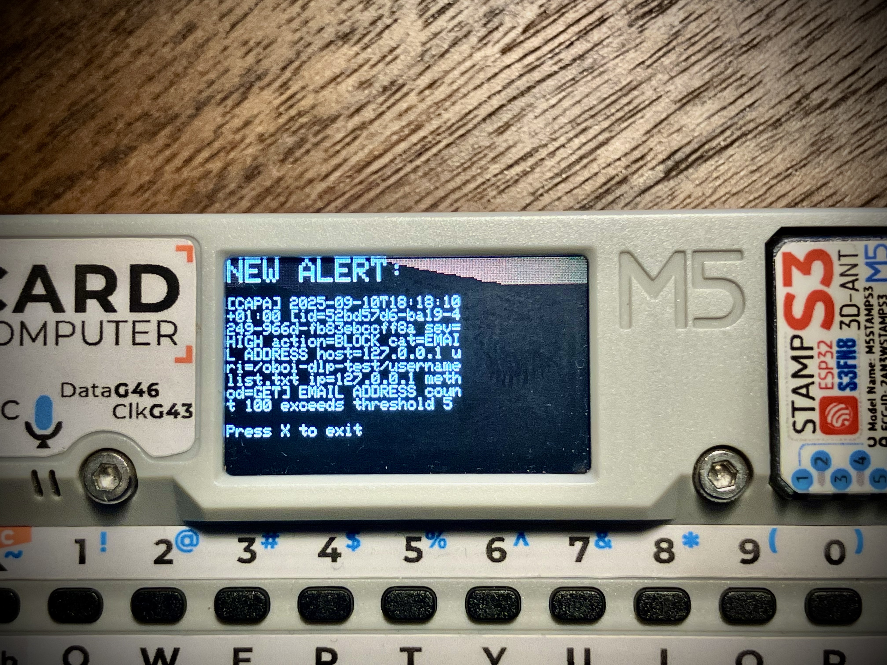

# cardputer-ntfy
A simple way to monitor ntfy.sh topics on M5 Cardputer. Designed as a way to monitor server data leak notifications from oboi-dlp but the user can easily set the ntfy topic in the under interface and use as a ntfy pager for any topic

Install via M5Burner. 

**SD images: ** The optional SD card images should be copied manually to your SD card root directory, but cardputer ntfy will use ASCII art if they are not found.

## Instructions

The app is super simple. Turn on, choose option A, set your SSID, B, set your ntfy topic and P, enter your WiFi password. 

Once connected the app will create the configuration on your SD card and you wont need to enter again.

The notifications are saved to SD card as alerts.txt. For now only 20 alerts are saved then the file cycles.

For suggestions and comments please use the issues and discussions in Github.

Thanks
Scot

Buy me a coffee at well... buy me a coffee... :) 

